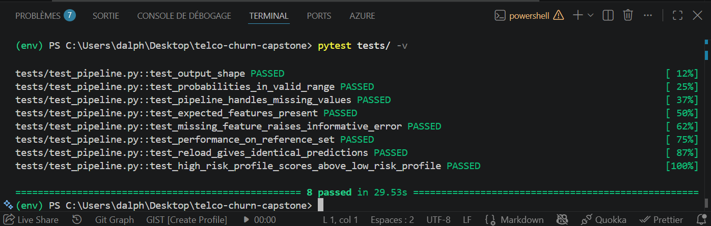
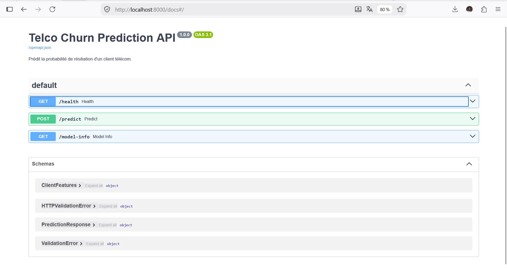
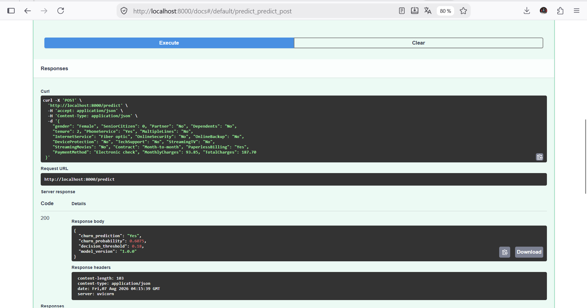

# Prédiction du Churn Telco — Projet Final Supervised Learning


Prédit la probabilité de résiliation d'un client télécom pour prioriser les offres
de rétention.

- Rapport technique complet (les 6 missions) : `REPORT.md` / `docs/rapport_final.pdf`
- Version pédagogique (niveau intermédiaire) : `REPORT_INTERMEDIAIRE.md` / `docs/rapport_intermediaire.pdf`
- Model card : `MODEL_CARD.md`

## Problème

Dataset Telco Customer Churn (IBM Sample, ~7 000 clients). Classification binaire :
un client va-t-il résilier son abonnement ? Coût métier asymétrique (un churner manqué
coûte ~3,7× plus cher qu'une offre envoyée à tort) — voir Mission 0 dans `REPORT.md`.

## Modèle

Régression logistique (elasticnet, `class_weight='balanced'`), tunée par Optuna,
calibrée (Platt/sigmoid), seuil de décision optimisé sur le coût métier (0,18).
F2-score sur test : 0,75. Détails complets : `REPORT.md` (Missions 2 à 4).

## Structure du dépôt

```
data/                dataset brut
notebooks/            01_eda, 02_pipeline_baseline, 03_modeling_comparison,
                       04_tuning_calibration_shap (exécutés, sorties visibles)
src/                  code source réutilisable (pipeline, features, modèle, entraînement)
tests/                suite de tests pytest
api/                  API FastAPI (health, predict, model-info)
model/                modèle sérialisé (.joblib) + métadonnées (généré par src/train.py)
docs/                 rapports PDF + captures d'écran + rapport de monitoring (Evidently)
.github/workflows/    CI GitHub Actions (tests automatiques à chaque push)
Dockerfile            image Docker pour l'API (build + run sans installation locale)
LICENSE               licence MIT
REPORT.md             rapport complet du projet (les 6 missions)
REPORT_INTERMEDIAIRE.md  version pédagogique du rapport
MODEL_CARD.md         model card du modèle déployé
```

## Installation

```bash
git clone https://github.com/Alpha-vsc/telco-churn-capstone.git
cd telco-churn-capstone
pip install -r requirements.txt
```

Testé avec Python 3.12.

## Reproduire le projet

```bash
# 1. Entraîner et sérialiser le modèle final (évalue sur le test, puis réentraîne sur 100% des données)
python src/train.py

# 2. Lancer les tests
pytest tests/ -v

# 3. Lancer l'API
uvicorn api.main:app --reload --port 8000
```

## Utiliser l'API

```bash
# Statut
curl http://localhost:8000/health

# Métadonnées du modèle
curl http://localhost:8000/model-info

# Prédiction
curl -X POST http://localhost:8000/predict \
  -H "Content-Type: application/json" \
  -d '{
    "gender": "Female", "SeniorCitizen": 0, "Partner": "No", "Dependents": "No",
    "tenure": 2, "PhoneService": "Yes", "MultipleLines": "No",
    "InternetService": "Fiber optic", "OnlineSecurity": "No", "OnlineBackup": "No",
    "DeviceProtection": "No", "TechSupport": "No", "StreamingTV": "No",
    "StreamingMovies": "No", "Contract": "Month-to-month", "PaperlessBilling": "Yes",
    "PaymentMethod": "Electronic check", "MonthlyCharges": 93.85, "TotalCharges": 187.70
  }'
```

Documentation interactive (Swagger) : `http://localhost:8000/docs`.

## Lancer l'API avec Docker

Alternative sans installation locale de Python :

```bash
docker build -t telco-churn-api .
docker run -p 8000:8000 telco-churn-api
```

L'image entraîne le modèle au moment du build (`src/train.py`), donc `docker run` suffit
ensuite — aucune dépendance à installer sur la machine hôte.

## Monitoring — exemple de rapport de drift

`src/monitoring.py` génère un rapport [Evidently](https://www.evidentlyai.com/) réel
comparant la distribution du train (référence) à celle du test (proxy d'un nouveau
batch de production) — voir `REPORT.md` (Mission 5) pour la méthodologie complète.

```bash
python src/monitoring.py
# -> ouvre docs/monitoring_report.html dans un navigateur
```

## Preuves d'exécution

Le projet a été testé de bout en bout en local (Windows, VS Code) avant rendu.

**Suite de tests pytest — 8/8 passants :**



**API — documentation interactive générée automatiquement (Swagger) :**



**API — réponse réelle de `POST /predict`** (profil à haut risque : nouveau client,
contrat mensuel, fibre optique) :



## Performances de référence

| Métrique | CV train (5-fold) | Test (tenu à l'écart jusqu'à M5) |
|---|---|---|
| F2-score | 0,7221 (± 0,0290) | 0,7475 |
| Precision | 0,457 | 0,4526 |
| Recall | 0,892 | 0,8930 |
| Brier score (calibré) | 0,1353 | 0,1382 |

## Reproductibilité

`random_state=42` fixé partout. `requirements.txt` épinglé aux versions effectivement
utilisées. Notebooks entièrement ré-exécutés de bout en bout (sorties visibles).

## Auteur

Alpha Oumar Diallo — Master IA, Supervised Learning — Enseignant : Ibrahima SY
